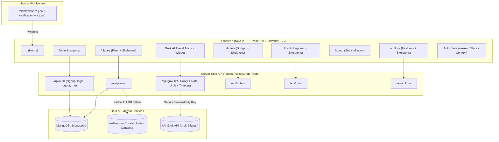

# Implementation Plan: Go-Bharat Full-Stack Architecture (Phase 2 - Final 40%)

Build out the remaining 40% of the **Go-Bharat** web application with zero regressions, type safety, fail-safe degradation, and a cohesive modern Indian travel aesthetic.

---

## User Review Required

> [!IMPORTANT]
> **Database Architecture Decision:**
> We will implement **MongoDB with Mongoose** inside Next.js App Router API Route Handlers. To guarantee zero white-screen crashes and effortless local development, the system will feature a **Dual-Mode Graceful Fallback**:
> 1. If `MONGODB_URI` is provided, it connects to MongoDB with connection caching.
> 2. If `MONGODB_URI` is missing or MongoDB is unreachable, it seamlessly falls back to pre-seeded in-memory authentic Indian travel datasets without throwing fatal errors.

> [!IMPORTANT]
> **Environment Variables Required:**
> We will create a `.env.example` file. You will need to provide:
> - `MONGODB_URI` (e.g., `mongodb+srv://...` or `mongodb://localhost:27017/gobharat`)
> - `JWT_SECRET` (secure random string for signing auth tokens)
> - `GROK_API_KEY` (xAI API key for the Grok AI proxy; kept strictly server-side)
> - `GEMINI_API_KEY` (existing key for trip planner)

---

## Open Questions

1. **Protected Route Scope:** Currently, we propose protecting `/plan-trip` (or requiring login when generating/saving a trip) while leaving `/places`, `/hotels`, `/food`, `/culture`, and `/about` public for browsing. Does this align with your product requirements?
2. **Grok AI Integration Point:** In addition to the secure server-side route `/api/grok`, should we add an interactive floating "Ask Grok AI Guide" widget on the explore pages so users can experience real-time travel recommendations directly in the UI?

---

## Proposed Architecture & Changes



---

## Dependencies to Install

In `c:/Users/rishi/Downloads/Go-Bharat2-master/Go-Bharat2-master/package.json`:
- `mongoose`: MongoDB object modeling and schema validation
- `bcryptjs` & `@types/bcryptjs`: Secure password hashing without native compilation issues
- `jose`: Edge & Node.js compatible JWT signing and verification for Next.js Middleware
- `zustand`: Lightweight, type-safe client-side state management

---

## Detailed File Modifications & Additions

### 1. Core Utilities & Security (`lib/`)

#### [NEW] [mongodb.ts](file:///c:/Users/rishi/Downloads/Go-Bharat2-master/Go-Bharat2-master/lib/mongodb.ts)
- Global connection caching pattern tailored for Next.js serverless and long-lived instances.
- Handles connection timeouts gracefully without crashing server routes.

#### [NEW] [jwt.ts](file:///c:/Users/rishi/Downloads/Go-Bharat2-master/Go-Bharat2-master/lib/jwt.ts)
- Uses `jose` (`SignJWT`, `jwtVerify`) to issue and verify tokens compatible with both Edge Middleware and Node.js route handlers.
- Configures 7-day expiration and secure cookie attributes (`httpOnly`, `sameSite: 'lax'`, `secure` in production).

#### [NEW] [auth.ts](file:///c:/Users/rishi/Downloads/Go-Bharat2-master/Go-Bharat2-master/lib/auth.ts)
- Password hashing helper with `bcryptjs.hash(..., 10)` and `bcryptjs.compare`.
- Input validation helpers (email format, password strength).

#### [NEW] [rate-limiter.ts](file:///c:/Users/rishi/Downloads/Go-Bharat2-master/Go-Bharat2-master/lib/rate-limiter.ts)
- In-memory sliding window rate limiter to protect `/api/grok` and `/api/auth/*` against denial-of-service and API key drain.

#### [NEW] [sample-data.ts](file:///c:/Users/rishi/Downloads/Go-Bharat2-master/Go-Bharat2-master/lib/sample-data.ts)
- Rich, high-fidelity datasets representing real Indian destinations, luxury/budget hotels, regional culinary traditions, and cultural heritage festivals across North, South, East, West, and Northeast India.
- Serves as auto-seeder for MongoDB and immediate zero-crash fallback.

---

### 2. Database Models (`models/`)

#### [NEW] [User.ts](file:///c:/Users/rishi/Downloads/Go-Bharat2-master/Go-Bharat2-master/models/User.ts)
- Fields: `name`, `email` (unique, lowercase), `password` (hashed), `avatar`, `role`, `savedTrips`, `createdAt`.
- Method to return sanitized JSON without password.

#### [NEW] [Place.ts](file:///c:/Users/rishi/Downloads/Go-Bharat2-master/Go-Bharat2-master/models/Place.ts)
- Fields: `name`, `state`, `region`, `category` (Heritage, Nature, Beach, Spiritual, Hill Station, Adventure), `description`, `images`, `rating`, `bestTimeToVisit`, `highlights`, `entryFee`, `timings`.

#### [NEW] [Hotel.ts](file:///c:/Users/rishi/Downloads/Go-Bharat2-master/Go-Bharat2-master/models/Hotel.ts)
- Fields: `name`, `destination`, `state`, `pricePerNight`, `rating`, `reviewsCount`, `amenities`, `images`, `address`, `bookingUrl`, `roomTypes`.

#### [NEW] [Food.ts](file:///c:/Users/rishi/Downloads/Go-Bharat2-master/Go-Bharat2-master/models/Food.ts)
- Fields: `name`, `region`, `state`, `type` (Vegetarian, Non-Vegetarian, Dessert, Street Food, Beverage), `description`, `image`, `famousIn`, `priceRange`, `flavorProfile`.

#### [NEW] [Culture.ts](file:///c:/Users/rishi/Downloads/Go-Bharat2-master/Go-Bharat2-master/models/Culture.ts)
- Fields: `title`, `state`, `region`, `type` (Festival, Dance & Art, Music, Architecture, Tradition), `description`, `image`, `season`, `significance`.

---

### 3. Authentication Flow & Middleware

#### [NEW] [app/api/auth/signup/route.ts](file:///c:/Users/rishi/Downloads/Go-Bharat2-master/Go-Bharat2-master/app/api/auth/signup/route.ts)
- Handles `POST`: Validates name, email, password; checks for existing user (returns 409 if exists); hashes password; creates user in MongoDB; generates JWT; sets `auth_token` in `httpOnly` cookie; returns sanitized user object.

#### [NEW] [app/api/auth/login/route.ts](file:///c:/Users/rishi/Downloads/Go-Bharat2-master/Go-Bharat2-master/app/api/auth/login/route.ts)
- Handles `POST`: Validates credentials; checks user existence; verifies password with `bcryptjs`; issues JWT cookie; returns sanitized user.

#### [NEW] [app/api/auth/logout/route.ts](file:///c:/Users/rishi/Downloads/Go-Bharat2-master/Go-Bharat2-master/app/api/auth/logout/route.ts)
- Handles `POST`: Clears `auth_token` cookie.

#### [NEW] [app/api/auth/me/route.ts](file:///c:/Users/rishi/Downloads/Go-Bharat2-master/Go-Bharat2-master/app/api/auth/me/route.ts)
- Handles `GET`: Reads `auth_token` from cookies, verifies with `jose`, fetches current user info.

#### [NEW] [middleware.ts](file:///c:/Users/rishi/Downloads/Go-Bharat2-master/Go-Bharat2-master/middleware.ts)
- Protects private routes (e.g. `/plan-trip`).
- Verifies JWT in Edge runtime; redirects unauthenticated requests to `/login?redirect=/plan-trip`.

#### [MODIFY] [app/login/page.tsx](file:///c:/Users/rishi/Downloads/Go-Bharat2-master/Go-Bharat2-master/app/login/page.tsx)
- Replaces dummy `alert()` with live call to `/api/auth/login`.
- Displays loading spinner, error message callout, and redirects to intended route upon success.

#### [MODIFY] [app/sign-up/page.tsx](file:///c:/Users/rishi/Downloads/Go-Bharat2-master/Go-Bharat2-master/app/sign-up/page.tsx)
- Replaces dummy `alert()` with live call to `/api/auth/signup`.
- Validates password confirmation, handles 409 conflict errors ("Email already registered"), redirects to explore upon success.

---

### 4. Secure xAI Grok API Proxy

#### [NEW] [app/api/grok/route.ts](file:///c:/Users/rishi/Downloads/Go-Bharat2-master/Go-Bharat2-master/app/api/grok/route.ts)
- **Zero Client Leakage:** `GROK_API_KEY` is strictly accessed via `process.env.GROK_API_KEY`.
- **Rate-Limiting:** Enforces maximum 15 requests/min per IP.
- **Timeout Protection:** Employs `AbortController` with a 20-second timeout.
- **Sanitized Response:** Validates incoming user messages, queries `https://api.x.ai/v1/chat/completions` with system prompt focused on Indian travel guidance, and returns `{ success: true, message: "..." }`.
- **Graceful Error Handling:** If the Grok API times out, has an invalid key, or is unreachable, returns `{ success: false, error: "...", fallbackTip: "..." }` so the UI never crashes.

#### [NEW] [components/GrokAssistantModal.tsx](file:///c:/Users/rishi/Downloads/Go-Bharat2-master/Go-Bharat2-master/components/GrokAssistantModal.tsx)
- Floating "Grok AI Assistant" button available across content pages.
- Allows users to ask questions ("What is the best time to visit Spiti Valley?", "What are must-try street foods in Indore?").
- Features animated typing, loading state, error alert, and clear conversation history.

---

### 5. Content Expansion (APIs + UI)

#### [NEW] [app/api/places/route.ts](file:///c:/Users/rishi/Downloads/Go-Bharat2-master/Go-Bharat2-master/app/api/places/route.ts)
- `GET`: Supports filters `?category=Heritage&search=Taj&state=Uttar+Pradesh`.
- Fallback to curated mock database if MongoDB is not initialized.

#### [NEW] [app/api/hotels/route.ts](file:///c:/Users/rishi/Downloads/Go-Bharat2-master/Go-Bharat2-master/app/api/hotels/route.ts)
- `GET`: Supports filters `?city=Jaipur&budget=luxury&rating=4.5`.

#### [NEW] [app/api/food/route.ts](file:///c:/Users/rishi/Downloads/Go-Bharat2-master/Go-Bharat2-master/app/api/food/route.ts)
- `GET`: Supports filters `?type=Vegetarian&region=North`.

#### [NEW] [app/api/culture/route.ts](file:///c:/Users/rishi/Downloads/Go-Bharat2-master/Go-Bharat2-master/app/api/culture/route.ts)
- `GET`: Supports filters `?type=Festival&state=Kerala`.

#### [NEW] [components/Navbar.tsx](file:///c:/Users/rishi/Downloads/Go-Bharat2-master/Go-Bharat2-master/components/Navbar.tsx)
- Unified, responsive navigation with active page highlight, mobile drawer, and dynamic user profile/logout button based on Auth state.

#### [NEW] [components/Footer.tsx](file:///c:/Users/rishi/Downloads/Go-Bharat2-master/Go-Bharat2-master/components/Footer.tsx)
- Unified footer celebrating Indian heritage and tourism.

#### [NEW] [components/LoadingSkeleton.tsx](file:///c:/Users/rishi/Downloads/Go-Bharat2-master/Go-Bharat2-master/components/LoadingSkeleton.tsx)
- Reusable skeleton cards with pulse animation matching card aspect ratios.

#### [NEW] [components/ErrorMessage.tsx](file:///c:/Users/rishi/Downloads/Go-Bharat2-master/Go-Bharat2-master/components/ErrorMessage.tsx)
- User-friendly alert banner with retry trigger.

#### [NEW] [app/places/page.tsx](file:///c:/Users/rishi/Downloads/Go-Bharat2-master/Go-Bharat2-master/app/places/page.tsx)
- Dynamic search bar, category pill selector, interactive cards with ratings, state badges, best time to visit, and detail preview modal. Loading skeletons & error recovery built-in.

#### [NEW] [app/hotels/page.tsx](file:///c:/Users/rishi/Downloads/Go-Bharat2-master/Go-Bharat2-master/app/hotels/page.tsx)
- Filter by destination, budget tier (Budget, Moderate, Luxury), star rating; displays amenity tags, pricing in INR, reviews, loading skeletons & error recovery.

#### [NEW] [app/food/page.tsx](file:///c:/Users/rishi/Downloads/Go-Bharat2-master/Go-Bharat2-master/app/food/page.tsx)
- Veg / Non-Veg / Street Food / Dessert filter tabs, regional spice indicators, origin tags, loading skeletons & error recovery.

#### [NEW] [app/culture/page.tsx](file:///c:/Users/rishi/Downloads/Go-Bharat2-master/Go-Bharat2-master/app/culture/page.tsx)
- Festivals, traditional art forms, music, architectural wonders, season indicator, loading skeletons & error recovery.

---

### 6. About Section

#### [NEW] [app/about/page.tsx](file:///c:/Users/rishi/Downloads/Go-Bharat2-master/Go-Bharat2-master/app/about/page.tsx)
- Fully styled, responsive page matching Go-Bharat's warm Indian aesthetic:
  - Hero: "The Soul of Bharat - Exploring India's Living Heritage"
  - Mission & Vision: Promoting responsible tourism, uncovering hidden wonders.
  - Interactive Key Metrics: 28 States & 8 UTs, 1000+ Curated Spots, 500+ Cultural Traditions.
  - Core Pillars: Heritage Preservation, Sustainable Travel, AI Intelligence.
  - Call to Action linking to `/plan-trip` and `/places`.

---

### 7. Global State & Environment Configuration

#### [NEW] [context/AuthContext.tsx](file:///c:/Users/rishi/Downloads/Go-Bharat2-master/Go-Bharat2-master/context/AuthContext.tsx)
- Manages `user`, `loading`, `login`, `signup`, `logout`. Automatically checks `/api/auth/me` on mount.

#### [NEW] [.env.example](file:///c:/Users/rishi/Downloads/Go-Bharat2-master/Go-Bharat2-master/.env.example)
- Complete list of environment variables with documentation.

---

## Verification Plan

### Automated & Build Verification
1. Install dependencies (`npm install`).
2. Run TypeScript check and Next.js build:
   ```powershell
   npm run build
   ```
   Ensures zero compilation errors, zero type errors, and all routes are properly generated.

### Functional Verification
1. **Authentication:**
   - Test Signup flow with new user -> verify JWT cookie set and user redirected.
   - Test Signup with existing email -> verify 409 user-friendly error message.
   - Test Login flow with correct credentials -> verify session restored.
   - Test Login with wrong password -> verify 401 error message displayed.
   - Test Logout -> verify cookie removed and UI updates to "Sign In".
   - Test Protected Route (`/plan-trip` via unauthenticated request) -> verify redirect to `/login`.

2. **Secure Grok API Proxy:**
   - Send test POST to `/api/grok` with sample query.
   - Verify server-side execution, header sanitization, and structured JSON output.
   - Test rate-limiter and error handling when key is missing or simulated timeout.

3. **Content Expansion (Places, Hotels, Food, Culture):**
   - Test `GET /api/places`, `GET /api/hotels`, `GET /api/food`, `GET /api/culture`.
   - Verify category filters, search parameters, and JSON payloads.
   - Navigate to `/places`, `/hotels`, `/food`, `/culture` in browser or automated fetch, confirming loading skeletons and rendered cards.

4. **About Page:**
   - Verify `/about` renders with correct layout, typography, responsive grid, and zero broken links.
